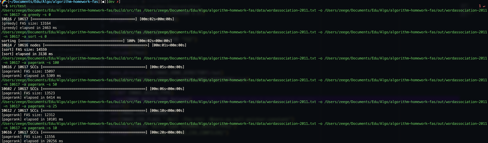

# Minimum Feedback Arc Set

English | [中文文档](/README-cn.md)

助教请看中文文档。

This repository is the unofficial implementation of the paper [Computing a Feedback Arc Set Using PageRank](https://doi.org/10.1007/978-3-031-22203-0_1), which is the homework for DCS5172@SYSU: Advanced Algorithm Design and Analysis (Spring 2023).

## Highlights

- Requires C++ STL only. No additional dependency is needed.
- Implemented in modern C++17 with flexibility.
- 30 - 90x accelaration on PageRankFAS, with a tradeoff of less than 0.5% larger FAS size.
- Nice progress bar to indicate the computation


## Quickstart

The project requires a C++17 compatible compiler. The following command is a quickstart to run all the tests to replicate the results in our report. We have a nice progress bar to indicate the current progress. All the tests (except the last one) takes 10 minutes approximiately, the last test is very large and may take 8 minutes.

```bash
# Compile the project
cmake -B build -DCMAKE_BUILD_TYPE=Release
cmake --build build
# Run the tests
sh ./test.sh
```

A possible output would be like:




Alternatively, if you want to pack the binary into a zip file:

```bash
cmake --build build --target package
```

## Usage

Upon success compilation, a CLI executable can be found at `build/src/fas`, which is the main entrance of the project. Here is an example to run it on the data in `data/simple.txt`. See `build/src/fas --help` for detailed usage. The `build/src/fas` executable is compiled from `src/main.cpp`, you can see the usages of APIs there.


For example, to run the `wordassociation-2011` dataset with `SortFAS`, use the command below:
```bash
./build/src/fas data/wordassociation-2011.txt -o out/wordassociation-2011 -a sort
```

The `PageRankFAS` has an additional argument `-s` to indicate the `k` value introduced in our report:

```bash
./build/src/fas data/wordassociation-2011.txt -o out/wordassociation-2011 -a pagerank -s 10
```

## Testing

Add your test and name it as `test/test_*.cpp`. Recompile the project `cmake --build build`. The executable target can be found at `build/test/`.


## Project Structure

```
FAS
 |-- data       # inupt data
 |-- include    # argument parser and progress bar library
 |-- src        # source code
 `-- test       # testing
```


